# Сайты

Ссылка: https://ads.vk.com/hq/pixels

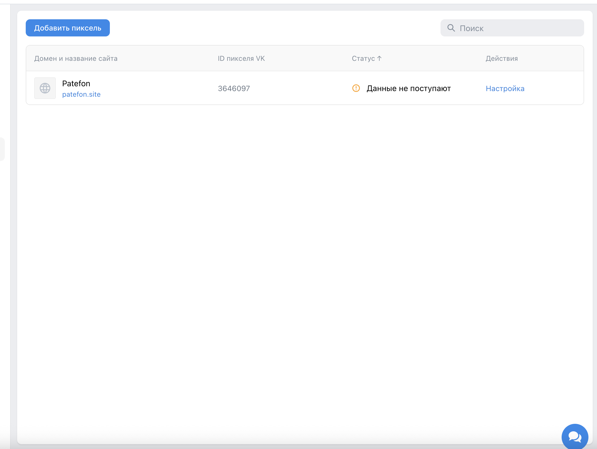

## Добавление пикселя

- При нажатии на кнопку "Создать пиксель" открывается диалоговое окно. Проверить наличие тега "Добавление пикселя".

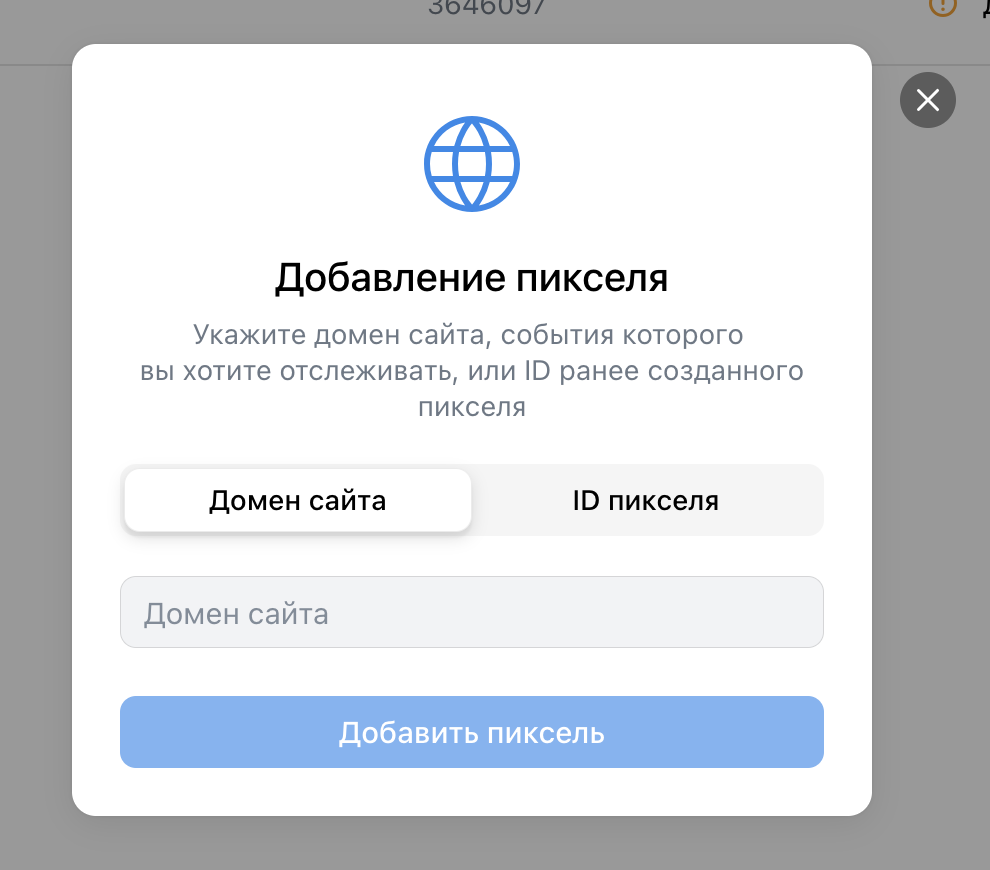

- При вводе в инпут домена строки "фапфпфыпфыпфы" и нажатии на кнопку "Добавить пиксель", возникает ошибка.

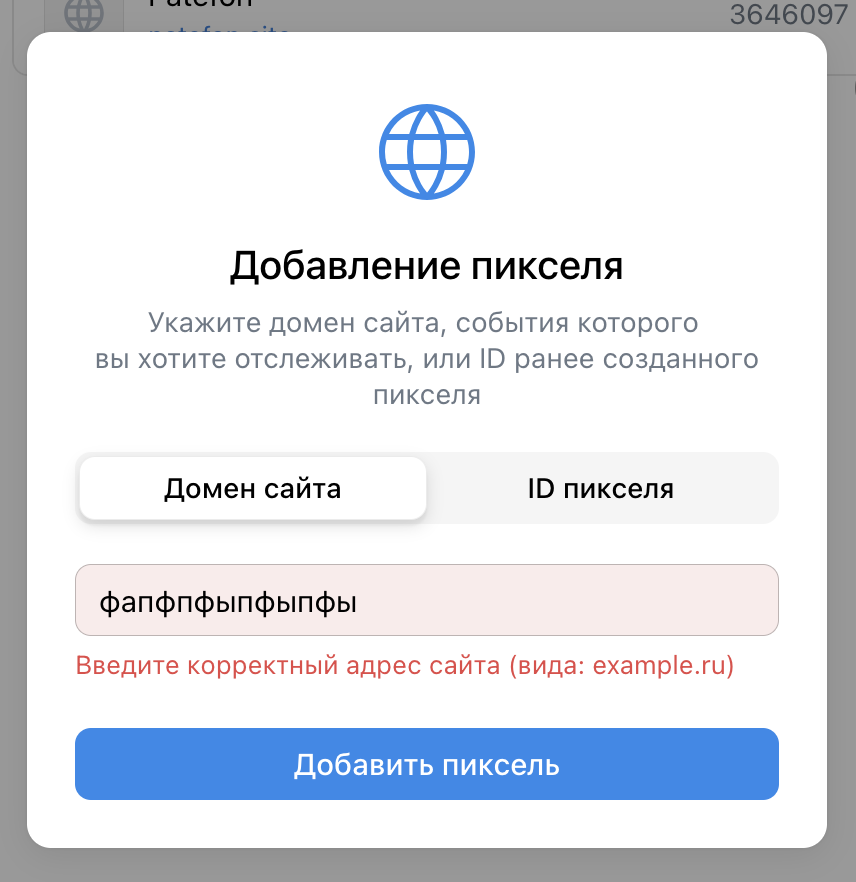

- При вводе в инпут домена строки "patefon.site" и нажатии кнопки "Добавить пиксель", открывается следующее диалоговое окно. Проверить наличие тега "Нашли пиксели, привязанные к сайту".

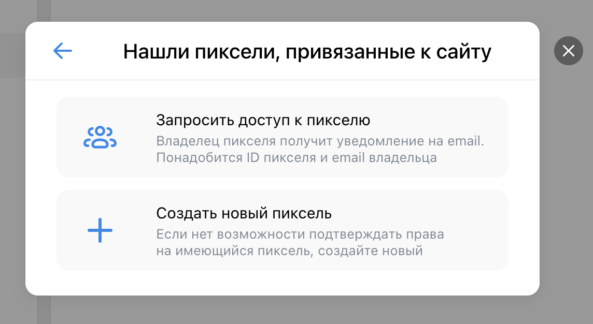

- При нажатии кнопки "Создать новый пиксель", открывается следующее диалоговое окно. Проверить наличие текстового тега "Создан ID пикселя". Сохранить последующий за ним id созданного пикселя в переменную.

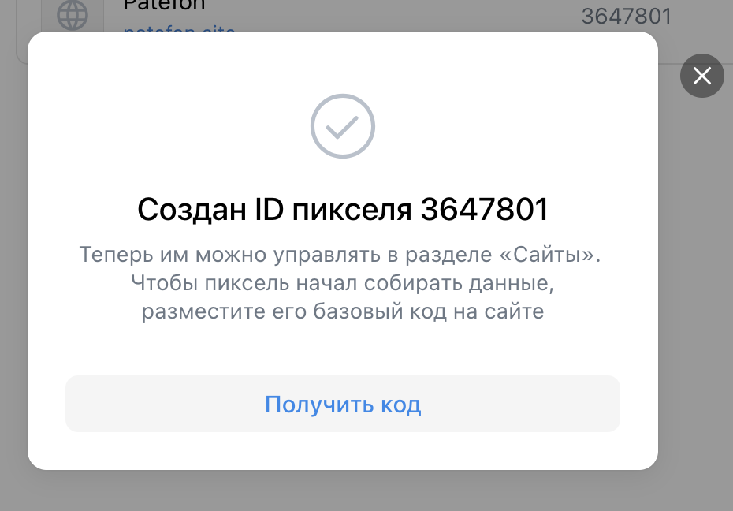

- При нажатии кнопки "Получить код", открывается новая вкладка. Проверить соответствие урла идентификатору созданного пикселя: "https://ads.vk.com/hq/pixels/**{id}**/code"

- Проверить в списке пикселей (урл: https://ads.vk.com/hq/pixels) наличие тегов созданного пикселя: "Patefon", "patefon.site" и его идентификатора.

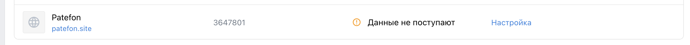

# Аудитории

Ссылка: https://ads.vk.com/hq/audience

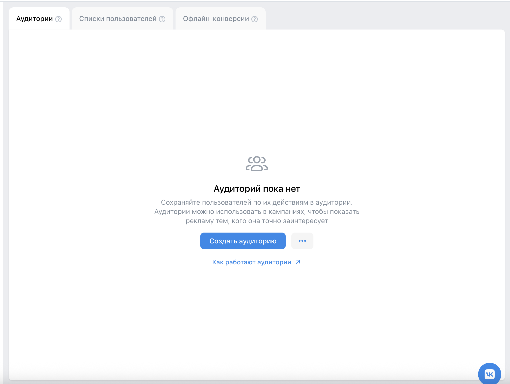

## Хедер

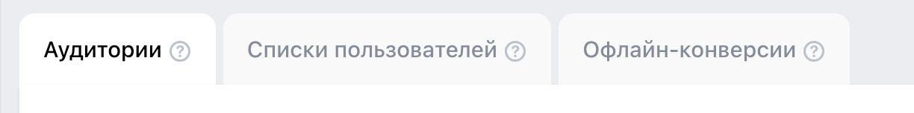

- При нажатии на кнопку "Списки пользователей", происходит переход на другую вкладку. Проверить, что урл совпадает с "https://ads.vk.com/hq/audience/user_lists". Проверить наличие тега "Списков пользователей пока нет".

- При нажатии на кнопку "Офлайн-конверсии", происходит переход на другую вкладку. Проверить, что урл совпадает с "https://ads.vk.com/hq/audience/offline_conversion".

- При нажатии на кнопку "Аудитории", происходит переход на другую вкладку. Проверить, что урл совпадает с "https://ads.vk.com/hq/audience".

## Создание аудитории

`Предварительно создаем пиксель Patefon для сайта patefon.site (описано выше)`

- При нажатии на кнопку "Создать аудиторию" открывается модальное окно. Проверить наличие тега "Создание аудитории".

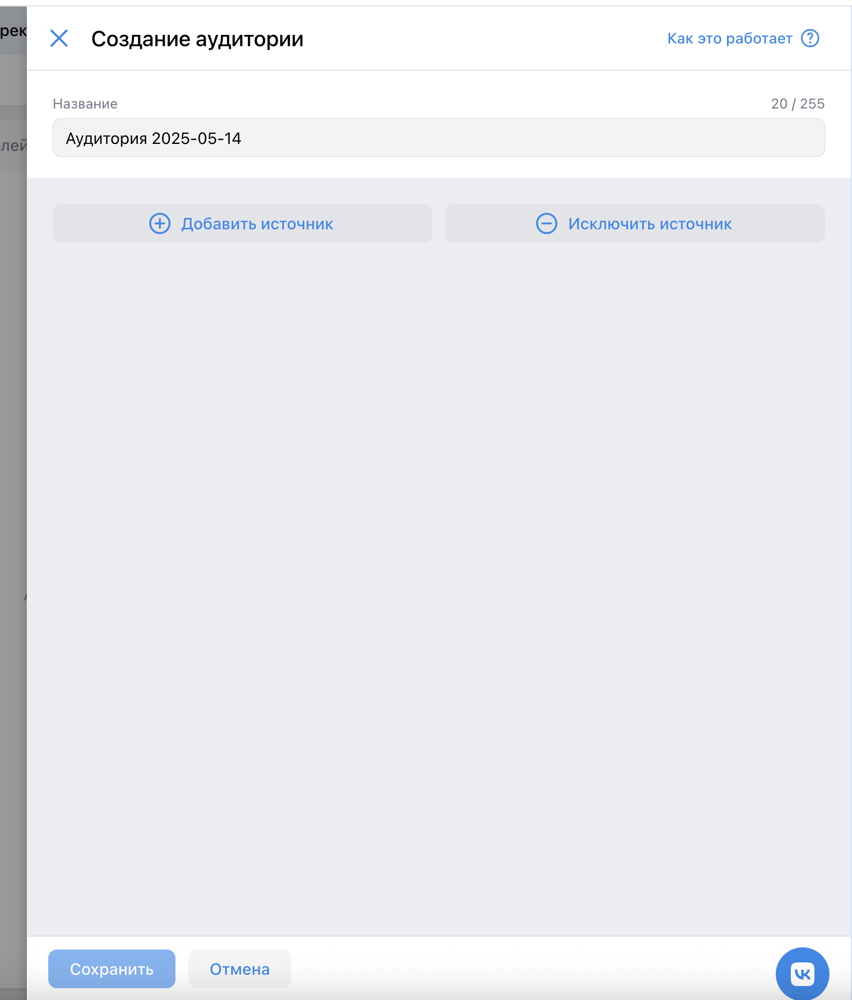

- При нажатии на кнопку "Добавить источник" открывается модальное окно. Проверить наличие тега "Добавить источник".

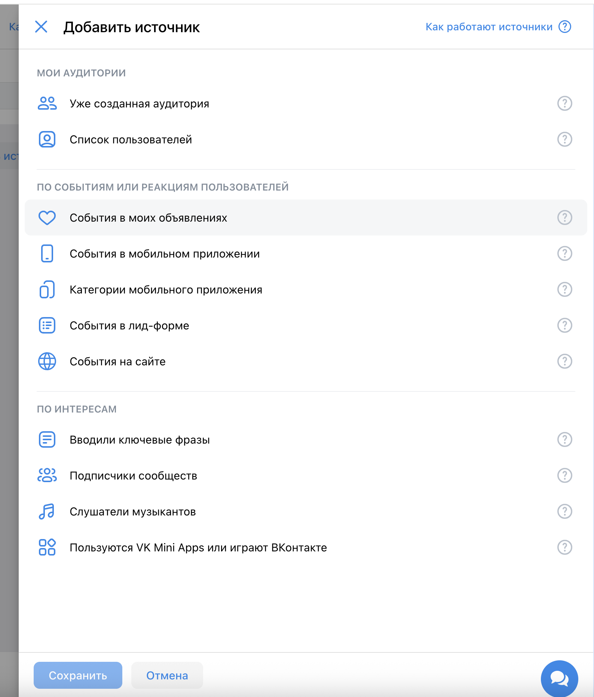

- При нажатии на кнопку "События на сайте" открывается модальное окно. Проверить наличие тега "События на сайте". Проверить наличие "Patefon" в инпуте выбранного пикселя.

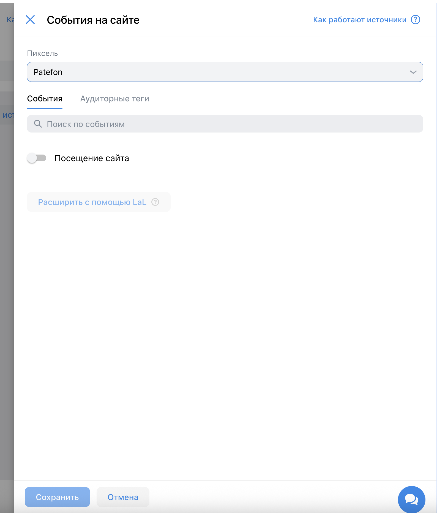

- При нажатии на свитч "Посещение сайта" появляется инпут периода (проверить по наличию тега "дней назад").

- При вводе в инпут периода "от" и "до" 1 и 365, и нажатии кнопки "Сохранить", происходит открывается модальное окно создания аудитории. Проверить наличие тега "Создание аудитории".
  Проверить в созданном событии наличие тегов "Patefon" и "Посещение сайта (1 - 365)".

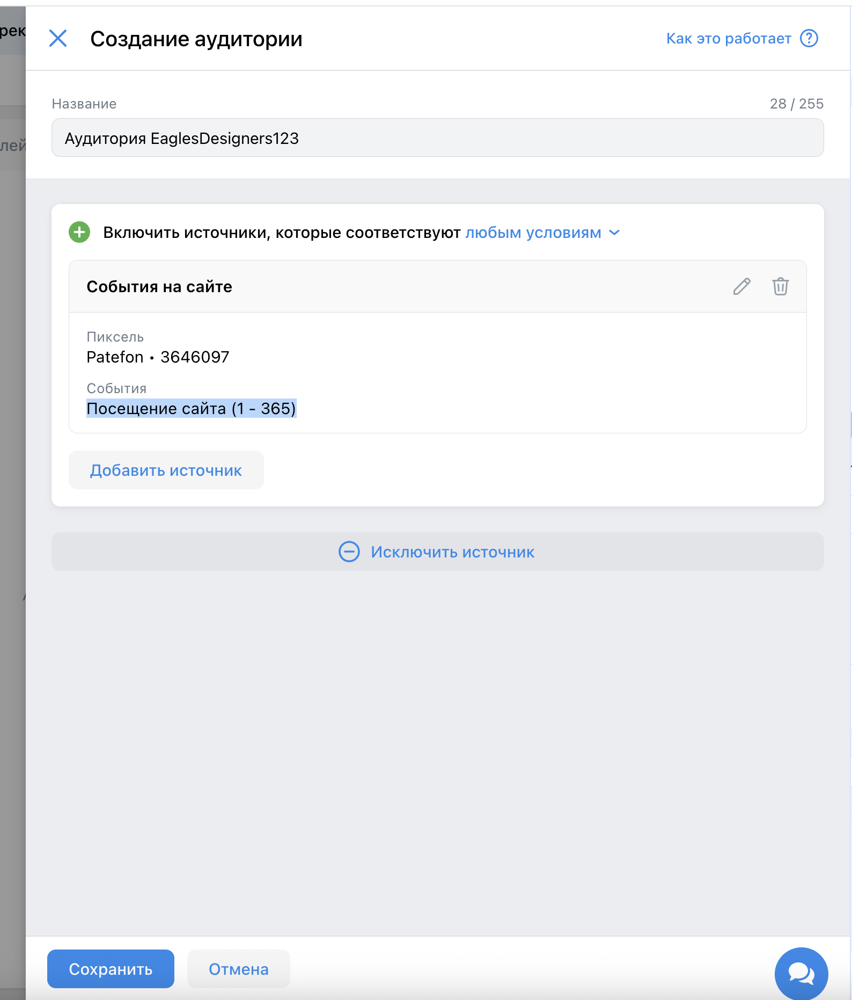

- При вводе в инпут названия аудитории "Аудитория EaglesDesigners123" и нажатии кнопки "Сохранить", модальное окно закрывается. Проверить наличие созданной аудитории "Аудитория EaglesDesigners123".

## Удаление аудитории

- Проверить, что до выделения аудиторий кнопка "Удалить" не кликабельна.

- При выделении чекбокса созданной аудитории "Аудитория EaglesDesigners123" и клике на кнопку "Удалить", появляется диалоговое окно. Проверить наличие тега "Удалить выбранную аудиторию?".

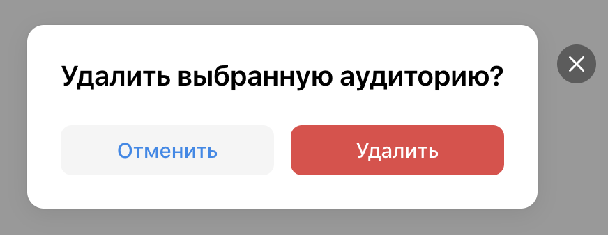

- При нажатии кнокпи "Удалить", диалоговое окно закрывается. Проверить наличие тега "Аудиторий пока нет".

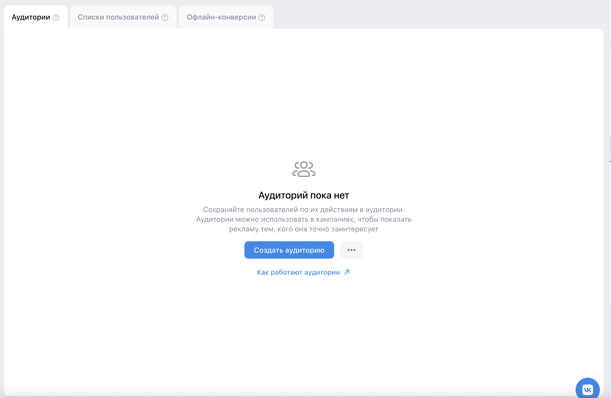

# Мобильные приложения

Ссылка: https://ads.vk.com/hq/apps

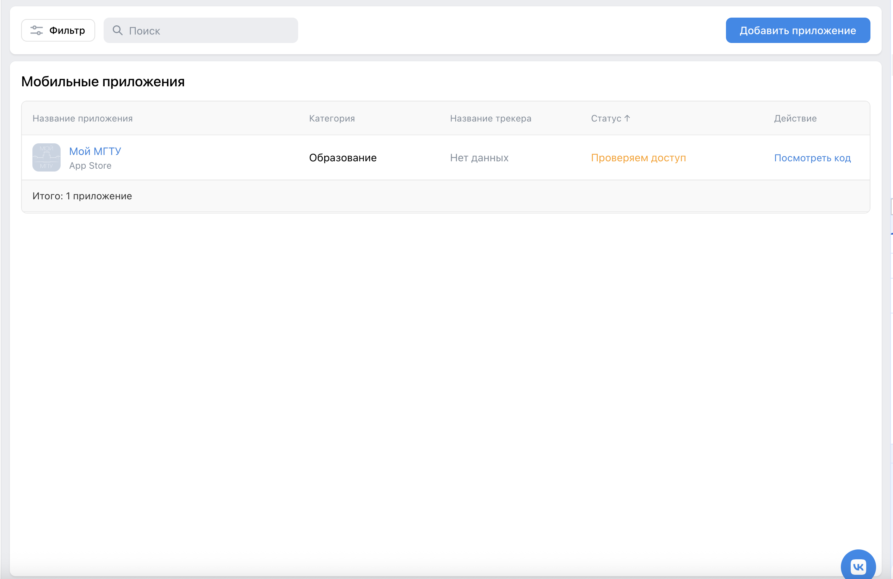

## Добавление приложения

- При нажатии на кнопку "Добавить приложение", открывается диалоговое окно. Проверить наличие тега "Привязка приложения".

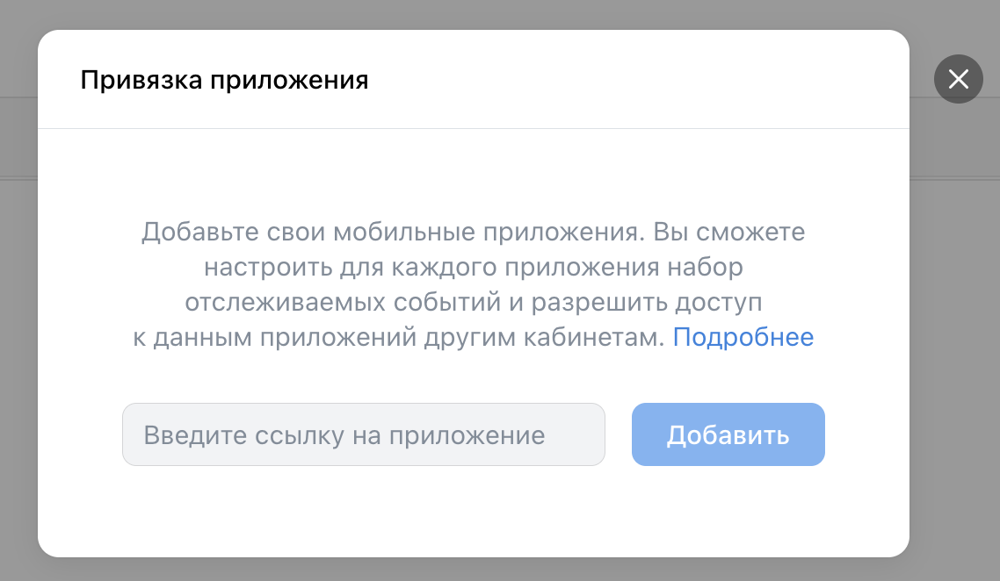

- Проверить, что при пустом инпуте ссылки на приложение, кнопка "Добавить" некликабельна.

- Проверить, что при вводе "abcd.efg" и клике на кнопку "Добавить", появляется ошибка.

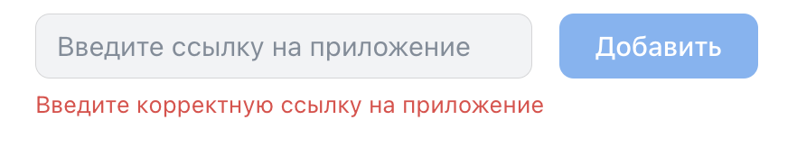

- При вводе "https://apps.apple.com/ru/app/%D0%BC%D0%BE%D0%B9-%D0%BC%D0%B3%D1%82%D1%83/id1641800679" и клике на кнопку "Добавить", открывается следующее диалоговое окно.

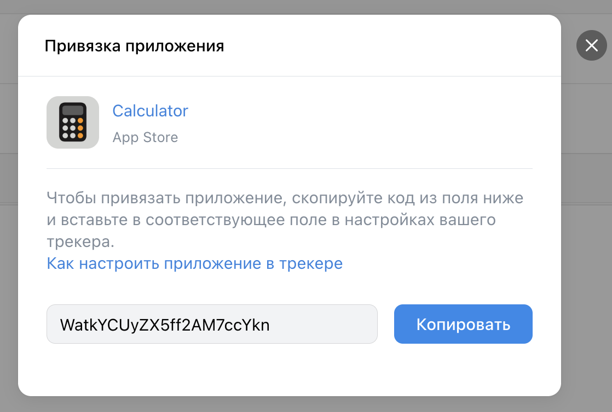

- Проверить, что при клике на кнопку "Копировать", код приложения из поля, помещается в буфер обмена.

- При клике на крестик, диалоговое окно закрывается. Проверить отсутствие тега "Привязка приложения".

- Проверить наличие в нового приложения в списке по тегу "Мой МГТУ".

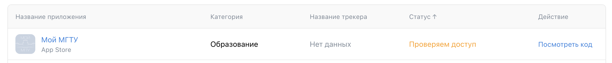
